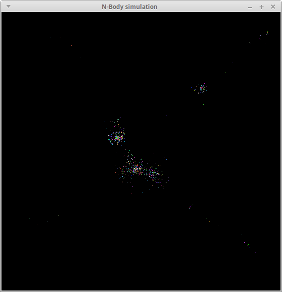

Due: **Monday, April 1st** by 11:59 PM

# Getting Started

Download [CS365\_Assign03.zip](CS365_Assign03.zip). Unzip it on the cluster head node (or your local machine, if you are running Linux).

To compile the sequential and parallel versions of the programs, run the command

    make

To run the programs:

    ./nbody_seq

    ./nbody_par

Note that the `nbody_par` program can take command line arguments:

* The `-t` argument specifies the number of worker threads to create
* The `-p` argument specifies the number of bodies ("particles") to create
* The `-f` argument specifies the number of animation frames to display

For example, to run with 8 worker threads and 2000 bodies, displaying 200 animation frames, the command would be

    ./nbody_par -t 8 -p 2000 -f 200

If you want to compile the program using Linux on your own computer, you will to build [libui](https://github.com/andlabs/libui).  If you are using Ubuntu, the following commands should work:

    sudo apt-get install libgtk-3-dev cmake
    cd /usr/local
    sudo mkdir libui
    sudo chown $USER:$USER libui
    git clone https://github.com/andlabs/libui.git
    cd libui
    mkdir build
    cd build
    cmake ..
    make

If you are using a distribution other than Ubuntu, I can help you build `libui`.

# Your task

The `nbody_seq` program is a sequential [N-Body simulation](https://en.wikipedia.org/wiki/N-body_simulation).  When you run the program, you will see something like the following:

> 

The program works by calling the `sim_tick` function repeatedly and drawing the positions of the simulated bodies as colored pixels in a GUI window.  You can see the code for the sequential version of the simulation in the `sim_seq.c` source file.

Your task is to parallelize the first loop in the `sim_tick` function, which accounts for the majority of the running time of the simulation.  The basic idea is fairly simple: create multiple worker threads in the `sim_create` function, and have each thread handle part of the range of indices of the computaton's (outer) loop when instructed to do so by `sim_tick`.  In other words, each time `sim_tick` is called, each worker thread should execute a loop that looks something like the following:

```c
for (int i = start_index; i < end_index; i++) {
    for (int j = 0; j < sim->num_particles; j++) {
        if (i != j) {
            particle_compute_attraction(&sim->particles[i], &sim->particles[j]);
        }
    }
}
```

where `start_index` and `end_index` define a range of indices in the `Simulation`'s `particles` array.

Note that the `sim_create` function should create as many threads as specified by the `num_threads` field in the `SimulationParams` object passed as a parameter: this will allow you to experiment with running the program using varying numbers of threads.

## Suggested approach

The main challenge in this program is to have the worker threads do the specified parts of the computation when necessary.  A good strategy is to use the `MTQueue` data structure you implemented in [Lab 8](../labs/lab08.html).  In the `Simulation` data type, allocate two instances of `MTQueue`.  One will be used by `sim_tick` to send work to the worker threads.  The other will be used by the worker threads to let `sim_tick` know that work has been completed.

When `sim_tick` is called, create "message" objects indicating ranges of indices to compute.  Add these message objects to the first queue.  The worker threads should execute a loop waiting for messages from `sim_tick`, and then perform the computation for the specified range of indices.  When a worker completes its work, it should create a "finished" message and add it to the second queue.  The `sim_tick` function will know that the entire computation (for one time step) has been completed when it has received "finished" messages for each range of indices.

If you do decide to use `MTQueue` in your parallel computation, you should

* copy `mtqueue.c` and `mtqueue.h` from the `CS365_Lab08` directory into the `CS365_Assign03` directory
* add the source file `mtqueue.c` to the `SRCS_COMMON` macro in `Makefile`
* add `#include "mtqueue.h"` to the source file `sim_par.c`

## Hints and Specifications

It is a requirement that your worker threads are long running.  In other words:

* The `sim_create` function should create the worker threads
* The `sim_destroy` function should cause them to exit, and should wait for them to exit
* The `sim_tick` function should cause the worker threads to do ranges of iterations of the main computation loop

It is *not* sufficient to have `sim_tick` create the worker threads and wait for them to complete each time it is called.

If you use the `MTQueue` based approach described above (highly recommended), `sim_tick` and the worker threads will need to communicate by passing messages to each other.  You will probably find it useful to define a message data type, e.g., something like the following:

```c
typedef struct {
    // ...message fields...
} Message;
```

Note that message objects should be dynamically allocated using `malloc`.  In general, it is never a good idea to pass pointers to objects allocated on one thread's stack (i.e., local variables) to another thread.  Don't forget to use `free` to deallocate message objects once they are no longer needed.

# Experiment

You will notice that when the program exits, it prints a message indicating how many animation frames were "missed."  A missed animation frame is when the computation from the previous frame is still running when the timer event for the current frame occurs.

Do some experiments to characterize under what circumstances the parallel version of the program misses animation frames.  Roughly, using varying numbers of threads, how many bodies can be simulated without missing a significant (10 or more) number of frames?

The `-f` option to run a fixed number of animation frames will be useful.

You should run your experiment on one of the compute nodes, rather than on the head node.  You can do this by using X forwarding.  For example, to run on `hitchhiker04`, you would use the command

    ssh -X hitchhiker04

from a terminal in your VNC session, `cd` to the directory with your program in it, and then run the program normally.

Include a report of your experiment, with the relevant data (number of missed frames for various combinations of number of threads and number of bodies.)  The report should be in a text file called `experiment.txt` included with your source code.  (This file will be submitted automatically when you run `make submit`.)

To visualize the load on the CPU cores, you can run the `coremon` program.  Just invoke the command

    coremon &

You can ignore the `Couldn't connect to accessibility bus` message.

# Grading

Your grade (max 100 points) will be determined as follows:

* Add fields to `Simulation` to allow communication with worker threads: 10 points
* Create long-running worker threads: 10 points
* `sim_tick` notifies worker threads when work is available: 30 points
* Worker threads do work when available and notify `sim_tick` when finished: 30 points
* Worker threads shut down when instructed to do so by `sim_destroy`: 10 points
* Experiment report: 10 points

# Submitting

Run the command

    make submit

Type your Marmoset username and password when prompted.

**Important**: After submitting your work, log into the Marmoset server (<https://cs.ycp.edu/marmoset>) and check your submitted code to make sure it is what you intended to submit.  *It is your responsibility to ensure that your work is submitted correctly.*

<!-- vim:set wrap: -->
<!-- vim:set linebreak: -->
<!-- vim:set nolist: -->
