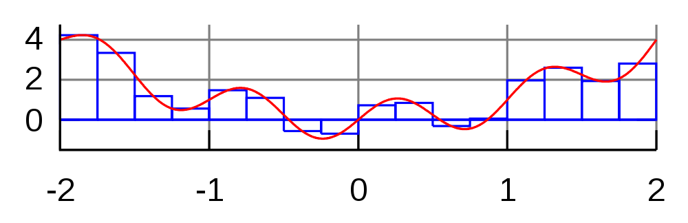

Getting Started
===============

Download [CS365\_Lab03.zip](CS365_Lab03.zip) to your cluster head node account. Unzip it.  You will edit the code in `integrate.c`.

Numerical Integration
=====================

Numerical integration works by sampling a series of points along a function, and computing the area of geometric shape (usually a rectangle or trapezoid) underneath each point. By summing the areas of the shapes, the area under the function's curve can be estimated.

In *midpoint approximation*, the series of points along the curve is chosen so that each chosen point is the midpoint of the top of a series of equal-width rectangles:

>  
> ([source: Wikipedia](http://en.wikipedia.org/wiki/File:Integration_rectangle.svg))

By increasing the number of rectangles, the accuracy of the result can be improved.

Your Task
=========

Your task is to use *numerical integration* to compute an approximation of the area under the curve of the function

> y = sin(x) + x1.3 cos(x) + x ln(x)

in a specific range of x values.

The program will use MPI to allow parallel processes to work on different parts of the problem simultaneously.

Process 0 should read three user input values: *xmin*, *xmax*, and *nrects*. The first two values (*xmin* and *xmax*) are the minimum and maximum x values. The third value (*nrects*) is the number of rectangles that should be used in the overall approximation. (I.e., if there are *P* processes, each one should compute about *nrects*/*P* rectangles.)

These values should be broadcast to the other processes using **MPI\_Bcast**.

Each process should use its rank to determine in which range of x values it will estimate the area under the function's curve. Use midpoint approximation to determine the rectangles whose areas will be added to produce the local approximation of the area under the curve.

When each process is done computing its local result, it should use **MPI\_Reduce** to compute the sum of all of the local results. Process 0 should be used as the root of the reduction, and should print the result.

Example run
-----------

Use the **runpar** script to run the program with a specific number of processors.

Here is an example run (user input in **bold**) with 10 processors:

<pre>
[dhovemey@cscluster]$ <b>./runpar 10</b>
xmin: <b>0.000001</b>
xmax: <b>10</b>
nrects: <b>100000</b>
area estimate is 77.935194
</pre>

Try running with the same input values but varying numbers of processors. The area estimate should be the same each time.

Requirements and Hints
----------------------

Only process 0 should read the input values. Use **MPI\_Bcast** to broadcast the input values to the other processes.

Think about how to divide up the work: each process should compute about the same number of rectangles.

Use **MPI\_Reduce** to reduce the local solutions down to a single global solution.

The **sin** and **cos** functions compute the sine and cosine (respectively) of an angle specified in radians.

The **pow** function raises a number to an arbitrary power: for example, **pow(x, 1.3)** would compute

> x1.3

The **log** function computes the natural log of its argument. (Use this for the ln(x) factor in the function.)

Note: do not include the value x=0 in your range because ln(0) is undefined.
