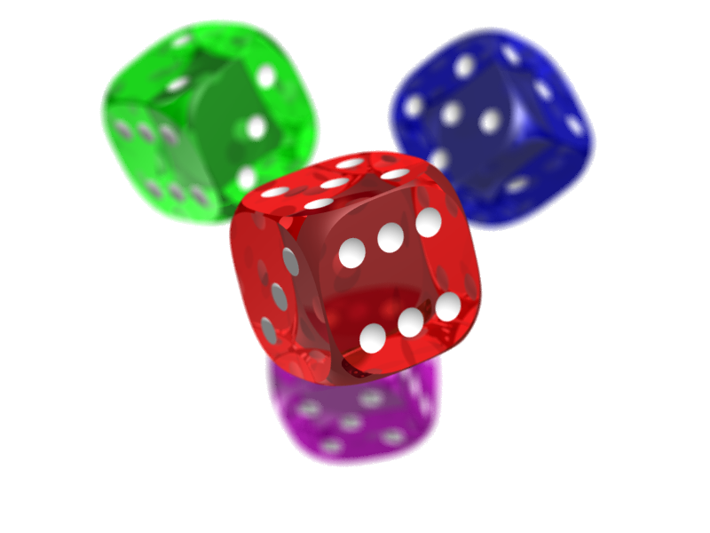
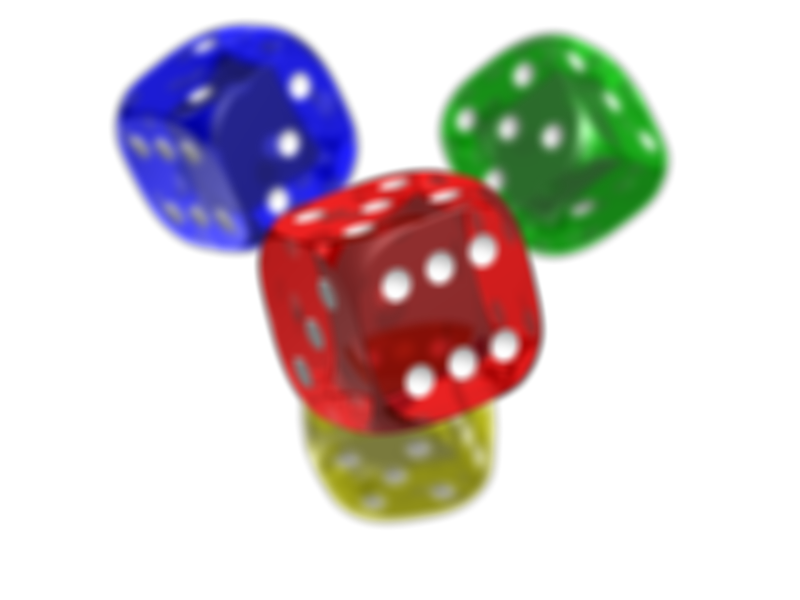

Getting Started
===============

Log into the cluster head node. Download [CS365\_Lab15.zip](CS365_Lab15.zip). Extract the contents of the archive into a directory.

Using a text editor, open the file **transformImage.cu**.

Now, log into deepthought:

    ssh deepthought

Using a Unix shell, use the **cd** command to navigate into the directory containing the extracted contents of the zip file.

When you run the **make** command on deepthought, a program called **transformImage** will be compiled. You can run it as follows:

<pre>
./transformImage <i>infile</i> <i>outfile</i>
</pre>

where *infile* is the name of an input image file, and *outfile* is the name of the output image file to write.

An example input image file called **dice.png** is provided. (Image from [Wikipedia](http://en.wikipedia.org/wiki/Portable_Network_Graphics).)

Your Task
=========

Use CUDA to implement some image transformation algorithms.

An example transformation which swaps the blue and green color component values is provided:

<table>
<tr> <th>Original</th> <th>Transformed</th> </tr>
<tr> <td></td>
<td></td></tr>
</table>

Here are some transformations you can try implementing.

Blur
----

Set each pixel value in the output image so that its component values (red, green, blue, and alpha) are the average of the component values of some number of surrounding pixels.  Be careful to avoid accessing nonexistent pixels.  (I.e., the pixels in the top row of the image don't have any neighbors above them.)

For example, here is the result of transforming an image so that each pixel in the output image is the component-wise average of the 11x11 block of surrounding pixels. (Click for full size image.)

<table>
<tr> <th>Original</th> <th>Transformed</th> </tr>
<tr> <td></td> <td></td></tr> 
</table>

Emboss
------

For each pixel, find the difference of its red, green, and blue component values compare to its upper-left neighbor. Of the three differences, find the one whose magnitude (absolute value) is the largest. Call this **diff**. It should be a signed integer in the range -255 to +255. Compute a gray value from **diff** as follows:

    int gray = 128 + diff;
    if (gray > 255) { gray = 255; }
    if (gray < 0) { gray = 0; }

Now, create a pixel color for the output image that uses this gray value for all 3 of the color components (red, green, blue). Use the same alpha value as the original pixel.

Example:

<table>
<tr> <th>Original</th> <th>Transformed</th> </tr>
<tr> <td></td><td></td> </tr>
 </table>
