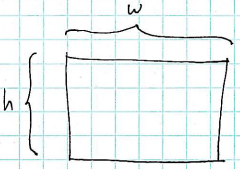
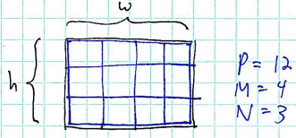
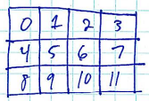
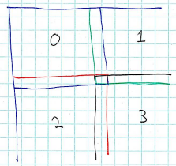

Parallel programs tend to have a number of common elements:

1.  Divide up the problem space, assigning work to each processor.
2.  Local computation.
3.  Communication between processors to share data.
4.  Combining local data to form a global solution.

A problem
=========

Example problem: cellular automaton to model a forest fire.

> Source: <http://schuelaw.whitman.edu/JavaApplets/ForestFireApplet/>

The above link no longer seems to exist, here is a similar simulation:

> <http://www.shodor.org/interactivate/activities/ABetterFire/>

Ideas:

-   The problem space is a grid of cells of size *w* x *h*
-   Possible cell states: empty, tree, burning tree
-   Dynamic behavior: at each time step of the simulation, a cell's next state is computed according to the simulation rules
    -   A burning tree becomes an empty cell
    -   A tree with a burning neighbor becomes a burning tree
    -   An empty cell becomes a tree (growth) with probability *pGrow*
    -   A tree with no burning neighbors becomes a burning tree (lightning strike) with probability *pLightning*

Dividing up the problem space
=============================

The overall problem space is an *w* by *h* grid:

> 

If the grid is very large, then we may be able to complete the computation (for some number of simulated time steps) by having a number of parallel processors compute cell values for regions of the overall grid.

Question: how should we assign regions to processors?

Simple approach: assuming we have *P* processors, we can divide up the overall grid into an *M* by *N* grid, where *M* x *N* = *P*.

> 

Here, we see a decomposition of the problem using 4x3 overlay grid, spreading the computation over 12 processors.

When dividing a problem, we have three general concerns:

1.  Dividing the computation evenly over the available processors
2.  Minimizing inter-processor communication
3.  Distributing initial data, managing local data

Dividing work evenly
--------------------

To address concern number 1, we make the rectangular regions assigned to each processor as close to the same size as possible. [Question: why?]

> **Life is hard**: for some computations, certain regions of the problem space may require more computation than others, so making the regions the same size may not actually divide the problem evenly!

So, each rectangular region of cells should be approximately *w*/*M* by *h*/*N*.

Note that we face a minor difficulty here: *w*/*M* and/or *h*/*N* may not be integers. So, we may need to make our regions slightly different sizes.

We can, in fact, formulate a general version of this problem: how to divide a range of *n* items into *num\_chunks* chunks, such that the chunks are as close to the same size as possible. (This is the one-dimensional variation of the two-dimensional problem described above.)

This is a problem that occurs very often in parallel programing. We can write a C function to do this job for us:

    void divide_work(int n, int num_chunks, int chunk_index, int *start_index, int *end_index)

The parameters are as follows:

-   **n** - the total number of items we want to divide up
-   **num\_chunks** - the number of chunks we want to create
-   **chunk\_index** - a value in the range 0..*num\_chunks*-1 identifying a particular chunk
-   **start\_index** - pointer to an integer variable in which the start index of the assigned chunk will be stored
-   **end\_index** - pointer to an integer variable in which the end index of the assigned chunk will be stored

Our approach is as follows: we initially assume that each chunk will have a size exactly equal to the floor of *n*/*num\_chunks*. Then we compute *r* = *n* **mod** *num\_chunks* - the remainder of dividing *n* by *num\_chunks*. The value *r* is thus the number of items not assigned to a chunk. We then assume that the chunks with indices 0..*r*-1 will each have their number of assigned items increased by 1.

Implementation:

    void divide_work(int n, int num_chunks, int chunk_index, int *start_index, int *end_index)
    {
        assert(n > 0);
        assert(num_chunks < n);

        int chunk_size = n / num_chunks;
        int r = n % num_chunks;

        *start_index = (chunk_index * chunk_size);

        if (chunk_index < r) {
            *start_index += chunk_index;
        } else {
            *start_index += r;
        }

        *end_index = (*start_index) + chunk_size;
        if (chunk_index < r) {
            (*end_index)++;
        }
    }

Each parallel process can use this function to determine its range of items based on its rank.

In the case of our *w* by *h* grid of cells, and assuming we have *M* by *N* processors, each parallel process could use the following code to determine its region of the computation:

    int rank = ...
    int size = ...

    int startx, endx, starty, endy;

    // based on rank, figure out this process's column and row in the
    // M x N grid
    int col = rank % M;
    int row = rank / M;

    divide_work(w, M, col, &startx, &endx);
    divide_work(h, N, row, &starty, &endy);

We're assuming that the processes assign themselves to regions in row-major order:

> 

**Issue**: processors controlling neighboring regions will need to communicate! We should ensure that the underlying network topology supports this communication pattern efficiently!

Minimizing communication
------------------------

In addition to dividing the problem to ensure equal sized subproblems, we should also try to minimize communication between processors. For our problem, we will try to minimize the length of the borders between neighboring regions. We can do this by making the regions as close to square as possible. A square has less perimeter than a more elongated rectangle, thus fewer data values need to be transferred at each time step.

Local data
----------

Each process will need an array in which to store the values for the cells in its region of the overall grid of cells.

Note that the local regions controlled by each processor must "overlap": the rows and columns of cells at the edges are shared with a processor controlling a neighboring region. This is necessary because of the rule that a tree catches fire if any of its neighbors are burning. For the cells at the edges of the local region controlled by a processor, a neighboring value

Consider the following diagram:

> 

For example, process 0 shares data with processes 1 (its right neighbor) and 2 (its bottom neighbor).

After each time step of the simulation, each processes must exchange data with its neighbors so that it knows the updated cell values computed by its neighbors.

Detail: each processor's local storage array has a one cell "border" on each side for data computed by neighboring processors. E.g., here is a close-up of a "left process" and a "right process". The shading (black and blue) indicates the portions of each local storage array in which the two processes are responsible for computing updated cell values at each time step:

> 

Local computation
=================

For our cellular automaton simulation, each local computation phase will compute a new value for each cell in its region.

Communication Between Processes
===============================

At the end of each time step of the simulation, each processor must exchange data with its neighbors.

Issue: must avoid deadlocks: two processors attempting to receive data from each other at the same time.

Sketch solution.

Combining Data
==============

After the desired number of time steps, the final simulation data can be accumulated. (E.g., all processes other than rank 0 could send their local data back to process 0.)
