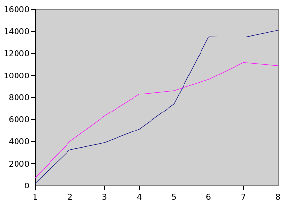

Blocking synchronization (e.g., mutex locks) can limit scalability with respect to the number of threads.

Atomic machine instructions such as compare and swap (CAS) allow the possibility of creating *lock-free* data structures.

CAS works by atomically

* testing a memory location to see if it contains an expected value
* if it does contain the expected value, storing a new value in the memory location

CAS can allow threads to make atomic updates to a data structure.  A requirement is that each CAS operation must leave the data structure in a consistent state.  (A mutex can guard a critical section with an arbitrary number of operations, so consistency is only required when the entire critical section completes.)

Java provides access to atomic machine instructions via the java.util.concurrent.atomic.Atomic\* classes (such as **AtomicReference**, **AtomicLong**, etc.)

Example lock-free algorithm: Maged Michael and Michael Scott, [Simple, Fast, and Practical Non-Blocking and Blocking Concurrent Queue Algorithms](https://www.cs.rochester.edu/u/scott/papers/1996_PODC_queues.pdf)

Benchmark results:

> 

The graph shows the amount of time needed to execute 10,000,000 enqueue/dequeue pairs on a queue using varying numbers of threads.  The x-axis is number of threads, and the y-axis is time in milliseconds.  The blue line is for a two-lock blocking queue implementation, and the magenta line is for the nonblocking queue described in the paper.

Queue implementations and benchmark code: [ConcurrentQueues.zip](ConcurrentQueues.zip)
